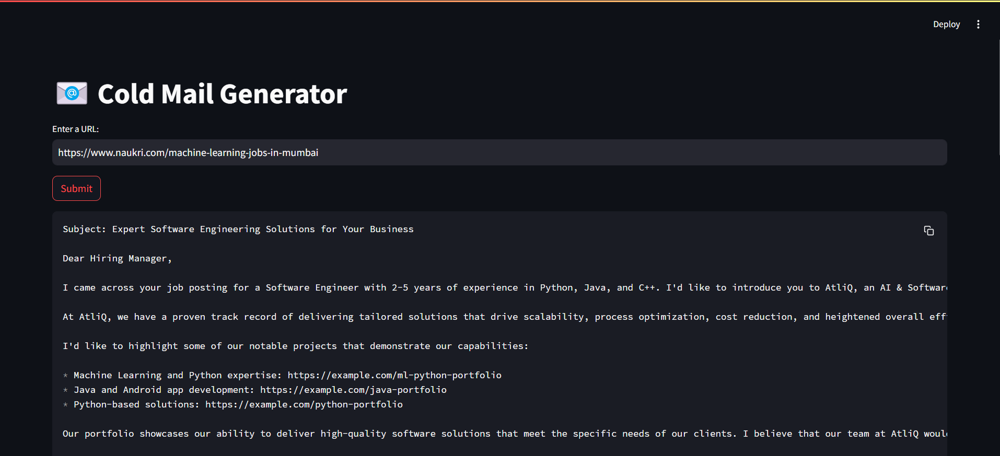

# Cold Email Generator for Job Applications

This Streamlit application generates personalized cold emails for job applications by extracting job information from a given URL and matching it with a portfolio of skills and links.

The Cold Email Generator is designed to streamline the process of creating targeted outreach emails for job seekers or business development professionals. It leverages natural language processing and web scraping techniques to analyze job postings and generate tailored email content.

Key features include:
- Web page scraping to extract job information
- Job data parsing and structuring
- Skill matching with a pre-defined portfolio
- Personalized email generation based on job requirements and portfolio links
- User-friendly Streamlit interface for easy interaction

## Application Screenshot



## Repository Structure

The project is organized as follows:

```
.
└── app
    ├── chains.py
    ├── main.py
    ├── portfolio.py
    └── utils.py
```

Key Files:
- `app/main.py`: The entry point of the application, containing the Streamlit UI setup and main logic flow.
- `app/chains.py`: Implements the `Chain` class for job extraction and email generation using LangChain and Groq API.
- `app/portfolio.py`: Manages the `Portfolio` class for loading and querying skill-based portfolio data.
- `app/utils.py`: Contains utility functions, such as `clean_text` for preprocessing scraped web content.

## Usage Instructions

### Installation

Prerequisites:
- Python 3.7+
- pip package manager

To set up the project, follow these steps:

1. Clone the repository:
   ```
   git clone <repository_url>
   cd <repository_name>
   ```

2. Install the required dependencies:
   ```
   pip install -r requirements.txt
   ```

3. Set up environment variables:
   Create a `.env` file in the project root and add your Groq API key:
   ```
   GROQ_API_KEY=your_groq_api_key_here
   ```

### Getting Started

To run the application:

1. Navigate to the project directory:
   ```
   cd <repository_name>
   ```

2. Start the Streamlit app:
   ```
   streamlit run app/main.py
   ```

3. Open your web browser and go to the URL provided by Streamlit (usually `http://localhost:8501`).

### Configuration

The application uses the following configuration:
- Groq API model: `llama-3.1-70b-versatile`
- Portfolio data file: `app/resource/my_portfolio.csv`
- Vector store: ChromaDB (persistent client with `vectorstore` directory)

### Common Use Cases

1. Generating a cold email for a specific job posting:
   - Enter the job posting URL in the text input field.
   - Click the "Submit" button.
   - The application will scrape the job information, match it with the portfolio, and generate a personalized cold email.

2. Analyzing multiple job postings from a company's career page:
   - Enter the URL of the company's career page.
   - Click the "Submit" button.
   - The application will attempt to extract multiple job postings and generate emails for each.

### Testing & Quality

To ensure the quality of the generated emails:
1. Manually review the extracted job information for accuracy.
2. Check if the skills mentioned in the email match the job requirements.
3. Verify that the portfolio links included are relevant to the job posting.

### Troubleshooting

Common issues and solutions:

1. "An Error Occurred: Context too big. Unable to parse jobs."
   - This error occurs when the scraped content is too large for the LLM to process.
   - Solution: Try using a more specific URL that points directly to a job posting rather than a general careers page.

2. "An Error Occurred: [Errno 2] No such file or directory: 'app/resource/my_portfolio.csv'"
   - This error indicates that the portfolio CSV file is missing.
   - Solution: Ensure that the `my_portfolio.csv` file exists in the `app/resource/` directory and contains the necessary skill and link data.

3. Empty or irrelevant email generation:
   - This may occur if the job information extraction fails or if the portfolio doesn't contain relevant skills.
   - Solution: 
     a. Check the URL to ensure it points to a valid job posting.
     b. Review and update the portfolio data to include a wider range of skills and relevant links.

To enable debug mode:
1. Add the following lines at the beginning of `app/main.py`:
   ```python
   import logging
   logging.basicConfig(level=logging.DEBUG)
   ```
2. Restart the Streamlit application to see more detailed log output.

## Data Flow

The Cold Email Generator processes data through the following steps:

1. User inputs a URL into the Streamlit interface.
2. The application loads the web page content using WebBaseLoader.
3. The loaded content is cleaned using the `clean_text` function.
4. The `Chain` class extracts job information from the cleaned text.
5. The `Portfolio` class loads and queries the skill-based portfolio data.
6. The `Chain` class generates a personalized email using the job information and matched portfolio links.
7. The generated email is displayed in the Streamlit interface.

```
[User Input] -> [Web Scraping] -> [Text Cleaning] -> [Job Extraction]
                                                          |
                                                          v
[Streamlit Display] <- [Email Generation] <- [Portfolio Matching]
```

Note: The application uses ChromaDB as a vector store for efficient querying of portfolio data based on job skills.